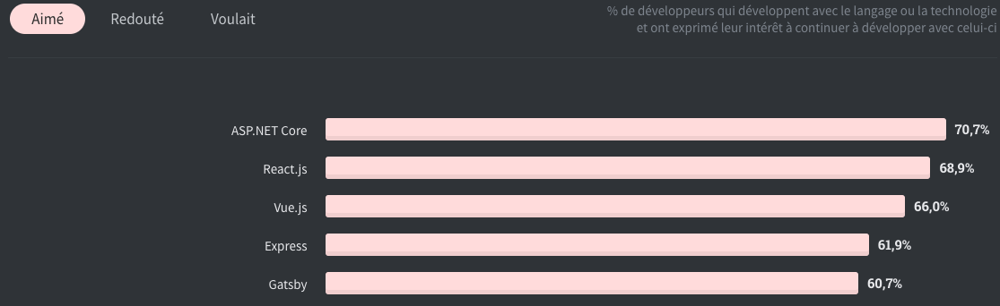
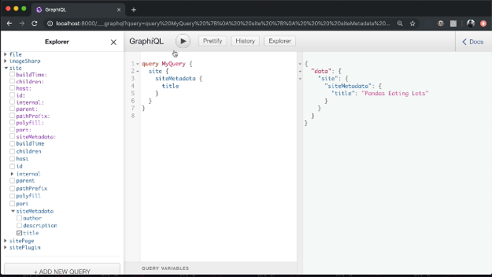

Et non, je ne vais pas vous parler ici du film tiré du roman de Francis Scott, interprété par le talentueux Leonardo DiCaprio.

Il est question plus précisément de Gatsby.js, c’est un framework open source qui vous permet la création de sites statique et application web également.

Initialement construit sur React.Js, il hérite donc de ses puissantes performances et si vous êtes déjà un fervent utilisateur de React, vous aurez d’autant plus plaisir à l’utiliser pour la réalisation de vos projets.

 
D'après un sondage mené par <a target="blank" href="https://insights.stackoverflow.com/survey/2020">Stackoverflow</a>, nous pouvons constater que le framework fraîchement 
arriver dans l’enquête, a su tirer grandement son épingle du jeu et se hisse à la 5e place du classement.

&nbsp;

&nbsp;

<h3>Mais qu’a-t-il de plus ?</h3>
&nbsp;

Par exemple pour la réalisation de page de blog simple (hors CMS), grâce à l’utilisation de fichiers en Markdown, qui est devenue de plus en plus populaire. Il suffit d’ajouter et de configurer le plugin gatsby-transformer-remark, qui va automatiquement lire et convertir votre fichier lors de la compilation et l’afficher via un composant.

 

Les plugins parlons-en, l’écho système de Gtasby offre une multitude d’extensions qui viendront s’ajouter à votre application en fonction de vos besoins
Pour n'en citer que quelques-uns :

Gatsby-plugin-google-analytics : pour ajouter facilement Google Ananlytics. 

Gatsby-theme-shopify-manager : permet de créer une boutique Shopify sur Gatsby.

<a  target="blank" href="https://www.gatsbyjs.org/plugins/">Source: https://www.gatsbyjs.org/plugins/</a>

&nbsp;

<h3>Ok et si j’ai besoin d’afficher des données ?</h3>

&nbsp;

Eh bien, "la question est vite répondue ! &#128517; &#128565; ", et réside en un mot GraphQl. 
Même s’il existe plusieurs solutions pour charger des données externes dans vos composants
(API, bases de données, CMS …).

GraphQl est une solution flexible et performante, qui je trouve fonctionne parfaitement avec Gtasby.
Même si je n’ai pas exploité pour le moment tout le potentiel de ce dernier, j’ai particulièrement apprécié l’interface GraphiQl, un outil qui vous aidera à structurer, correctement vos requêtes.

&nbsp;

&nbsp;

Pour en savoir plus je vous invite vivement, a consulté <a  target="blank" href="https://www.gatsbyjs.org/">la documentation officielle</a> de ce framework qui est riche en explication et en exemples détaillé.

Un <a target="blank" href="https://discord.com/invite/br9rbUE">Discord</a> est également disponible.

&nbsp;

<h3>Mais il n’y a pas que Gtasby dans la vie ?</h3>

&nbsp;

Non effectivement dans la famille Jamstack (Javascript | Apis | Markup),
Vous trouverez :

<ul>
    <li>Next.js (React),</li>
    <li>Nuxt (Vue),</li>
    <li>Slate (Ruby)</li>
</ul>

<a href="https://www.staticgen.com/">Et bien d’autres.</a>

Photo by <a href="https://unsplash.com/@vidson7?utm_source=unsplash&amp;utm_medium=referral&amp;utm_content=creditCopyText">Moises Jimenez</a>

